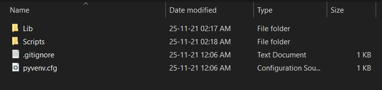
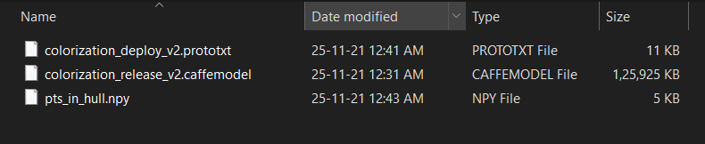
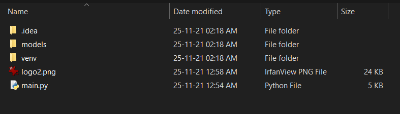

# Colorize Black and White Images
*****
This is a python based project on Colourizing Black and White Images using Deep Learning. 
[Click Here to view the screenshots of the project.](https://github.com/iamyuvraj/Colorize-Black-White-Images/blob/main/Screenshots.md)
*****

How to setup:
In order to run the program we will be needing a few libraries, modules and dependencies.

First, Create a folder called "venv" and install the following modules:

OpenCV - pip install opencv-python

Pillow - pip install pillow

NumPy - pip install numpy

TKinter - pip install tk

*****

"venv" folder should look like this:

Now, inside the "models" folder there should be three files: 
[1.] colorization_deploy_v2.prototxt 
[2.] pts_in_hull.npy 
[3.] colorization_release_v2.caffemodel 

"colorization_release_v2.caffemodel" file is not included because of large file size, we need to download, it can be found [here.](https://drive.google.com/drive/folders/1FaDajjtAsntF_Sw5gqF0WyakviA5l8-a) 
P.S. I don't have these files on my drive, credits to the file hoster.

After having all the files the "models" folder should look like this:

 The root folder should look like this:

***********************************************************************
